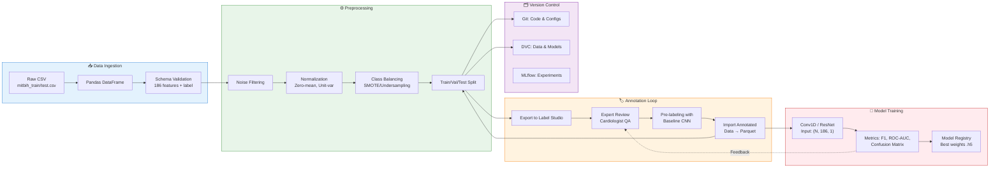

**Dataset Flow**

```mermaid
flowchart LR
    subgraph Data_Ingestion["📥 Data Ingestion"]
        A["Raw CSV\nmitbih_train/test.csv"] --> B["Pandas DataFrame"]
        B --> C["Schema Validation\n186 features + label"]
    end

    subgraph Preprocessing["⚙️ Preprocessing"]
        C --> D["Noise Filtering"]
        D --> E["Normalization\nZero-mean, Unit-var"]
        E --> F["Class Balancing\nSMOTE/Undersampling"]
        F --> G["Train/Val/Test Split"]
    end

    subgraph Annotation["🏷️ Annotation Loop"]
        G --> H["Export to Label Studio"]
        H --> I["Expert Review\nCardiologist QA"]
        I --> J["Pre-labeling with\nBaseline CNN"]
        J --> K["Import Annotated\nData → Parquet"]
        K --> G
    end

    subgraph Versioning["🗂️ Version Control"]
        L["Git: Code & Configs"] 
        M["DVC: Data & Models"]
        N["MLflow: Experiments"]
    end

    subgraph Training["🤖 Model Training"]
        O["Conv1D / ResNet\nInput: (N, 186, 1)"]
        P["Metrics: F1, ROC-AUC,\nConfusion Matrix"]
        Q["Model Registry\nBest weights .h5"]
    end

    G --> L & M
    K --> O
    O --> P --> Q
    P -.->|Feedback| I

    style Data_Ingestion fill:#e3f2fd,stroke:#1976d2
    style Preprocessing fill:#e8f5e9,stroke:#388e3c
    style Annotation fill:#fff3e0,stroke:#f57c00
    style Versioning fill:#f3e5f5,stroke:#7b1fa2
    style Training fill:#ffebee,stroke:#c62828
```
