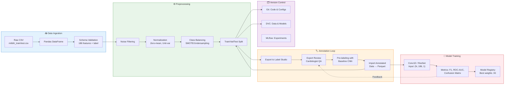

**Dataset Flow**



# 🫀 BeatSense — AI сервис анализа кардиограммы (ECG)

**BeatSense** — это MVP веб-приложения для автоматического анализа электрокардиограмм с использованием методов машинного обучения.
Сервис классифицирует сердечные ритмы и помогает в предварительной диагностике.

> ⚠️ Важно: проект не является медицинским устройством и не заменяет врача.

---

## 🚀 Возможности

* 📥 Загрузка ECG сигнала
* 🧠 Автоматическая классификация сердечного ритма
* 📊 Вывод результата с confidence score
* 📈 Визуализация кардиограммы
* ⚡ Быстрый анализ (несколько секунд)
* 🔌 API для интеграции (`/predict`)

---

## 🏗 Архитектура

Приложение состоит из трёх основных компонентов:

* **Frontend** — пользовательский интерфейс
* **Backend** — API и бизнес-логика
* **AI сервис** — модель машинного обучения

```
Frontend → Backend → AI Model → Backend → Frontend
```

---

## 🧠 AI модель

* Датасет: ECG Heartbeat Categorization Dataset
* Формат входа: ~187 точек сигнала
* Выход: класс ритма + вероятность

### Метрики (целевые):

* Accuracy ≥ 85%
* F1-score ≥ 0.80

---

## ⚙️ Технологический стек

**Frontend:**

* React

**Backend:**

* Python (FastAPI)

**AI:**

* PyTorch / TensorFlow

**Инфраструктура:**

* Локальный запуск или облако
* Без сложной оркестрации

---

## 📊 Основной функционал

Пользователь может:

1. Загрузить ECG сигнал
2. Нажать кнопку **Analyze**
3. Получить:

   * тип ритма
   * вероятность (confidence score)
   * график сигнала

---

## 📦 Установка и запуск

### 1. Клонировать репозиторий

```bash
git clone https://github.com/oRUTYo/health-checker.git
cd health-checker
```

---

### 2. Backend

```bash
cd backend
pip install -r requirements.txt
uvicorn main:app --reload
```

---

### 3. Frontend

```bash
cd frontend
npm install
npm run dev
```

---

### 4. AI модель

(пример)

```bash
cd ml
python train.py
```

---

## 🔌 API

### POST /predict

**Описание:**
Классификация ECG сигнала

**Вход:**

```json
{
  "signal": [0.1, 0.2, 0.3, ...]
}
```

**Выход:**

```json
{
  "class": "Normal",
  "confidence": 0.92
}
```

---

## 📏 Критерии успеха

* Accuracy ≥ 85%
* F1-score ≥ 0.80
* Время анализа ≤ 5 секунд
* API response < 1 сек
* Рабочий end-to-end сценарий

---

## ⚠️ Ограничения

* Не медицинская система
* Нет real-time обработки
* Нет интеграции с hospital systems
* Используется один датасет

---

## 🚧 Риски

* Переобучение модели
* Дисбаланс классов
* Низкая точность на реальных данных
* Ошибки интеграции компонентов

---

## 👥 Команда

* **Садиков Руслан** — Team Lead / System Architect
* **Зиганшин Ильяс** — Product Owner / Frontend Lead
* **Минникаев Мансур** — Backend Engineer
* **Шамсутдинов Рафаэль** — Machine Learning Engineer
* **Юссеф Алин** — Data & QA Engineer
* **Шайхетдинов Ильвир** — Frontend Engineer
* **Цзяо Цзэфэн** — Frontend Engineer / Data Visualization

---

## ✅ Definition of Done

MVP считается завершённым, если пользователь может:

* открыть приложение
* загрузить ECG
* нажать "Analyze"
* получить корректный результат за несколько секунд

---

## 📌 Планы на будущее

* Улучшение модели
* Поддержка реальных ECG данных
* Explainability (SHAP, LIME)
* Интеграции с медицинскими системами

---

## 📄 Лицензия

Проект разработан в учебных целях.

