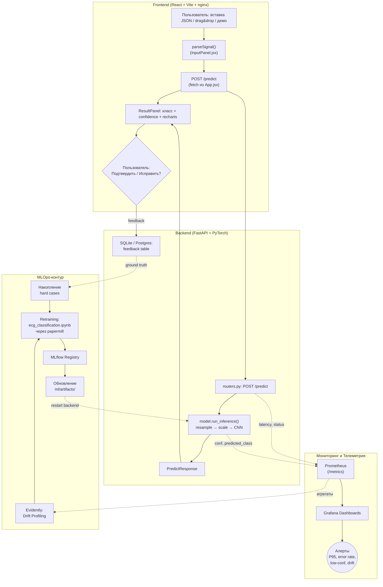

# ДЗ Лекция 7 — Monitoring, Drift и Retraining

**Проект:** BeatSense — веб-приложение для автоматической классификации ЭКГ-сигналов (5 классов сердечных сокращений по MIT-BIH).
**Команда:** учебный MVP, один разработчик.
**Стек:** React 18 + Vite + recharts (frontend), FastAPI + PyTorch (backend, инференс 1D CNN), Docker Compose, nginx (reverse-proxy на фронте).

---

## 1. Сервисный мониторинг

| Метрика | Frontend (React) | Backend (FastAPI) | Цель |
|---------|------------------|-------------------|------|
| **Availability** | Доля успешных загрузок SPA (nginx access log) | Healthcheck `GET /ping` в docker-compose, uptime процесса uvicorn | ≥ 99% |
| **P95 Latency** | Время от клика «Анализировать» до отрисовки результата в `App.jsx` | Время `run_inference()` в `src/backend/model.py` | API без ML < 1 с, E2E ≤ 5 с (PRD) |
| **Error Rate** | Доля ответов с `status != 200` на `/predict` (видна в `App.jsx` через `catch`) | HTTP 5xx, исключения в `load_artifacts()` и `run_inference()` | < 2% |
| **Throughput** | Кол-во кликов «Анализировать» в день | Кол-во POST `/predict` в день | Информативная |

**Где смотреть:** stdout контейнеров (`docker-compose logs backend frontend`), nginx access/error log, в перспективе — Prometheus-экспортёр на `/metrics` (через `prometheus-fastapi-instrumentator`).

---

## 2. Мониторинг входных данных

* **Пропуски и пустые значения:** в `src/backend/schemas.py` `PredictRequest.signal` имеет `min_length=2` — короткие/пустые массивы отсекаются на уровне Pydantic. На фронте `parseSignal()` (`InputPanel.jsx`) требует минимум 10 точек и максимум 50 000.
* **Некорректные входы:** парсер на фронте кидает понятные ошибки (`Некорректное значение [i]`, `Не удалось распознать формат данных`). Backend дополнительно валидирует тип через Pydantic — нечисловые элементы вернут 422.
* **Изменение структуры:** модель ожидает фиксированную длину 187 точек (`TARGET_LEN` в `model.py`). Любой входной сигнал линейно ресемплится через `_resample()` (`np.interp`). Сам факт ресемплинга нужно логировать: если массово приходят сигналы с длиной ≠ 187 (например, частота дискретизации сменилась с 360 Гц), это сигнал смены источника данных.
* **Изменение распределений:** датасет MIT-BIH нормализован MinMaxScaler в диапазон [0, 1]. Если на проде начинают приходить сигналы с большим количеством значений вне [0, 1] после применения скейлера — это признак сдвига распределения. Планируется логировать `mean`, `std`, `min`, `max` каждого входного сигнала до и после `scaler.transform()`.
* **Признаки data drift:** сигналы с другого аппарата ЭКГ (другая частота дискретизации, фильтрация, шум) — текстура заметно отличается. Ловится периодическим запуском Evidently-профилей по накопленным сигналам.

---

## 3. Мониторинг предсказаний модели

* **Контроль confidence:** в `run_inference()` (`src/backend/model.py:63`) считается `conf = float(probs[cls_id])` — максимальная softmax-вероятность. Это значение уходит в `PredictResponse.confidence` и показывается на фронте в `ResultPanel`.
* **Доля low-confidence:** порог `low_conf_threshold = 0.6` лежит в `meta.pkl` и применяется в `model.py:74-75`: при `conf < 0.6` лейбл подменяется на `"не уверен"`. Сейчас факт срабатывания не агрегируется — нужно логировать каждый low-confidence кейс с timestamp и длиной исходного сигнала.
* **Доля fallback:** доля ответов с `class == "не уверен"` к общему числу запросов. Целевой порог из CLAUDE.md — не более 20%; превышение → кандидат на retraining.
* **Распределение классов:** 5 классов (`0 Normal`, `1 Supraventricular`, `2 Ventricular`, `3 Fusion`, `4 Unknown`). На MIT-BIH ожидается доминирование `Normal` (~80%). Если в проде доля `Normal` упала ниже 50% — либо другой источник данных, либо деградация модели.
* **Аномальное поведение:** падение среднего confidence на 10+ п.п. за неделю или резкий перекос в один класс (например, > 95% `Unknown`) — сигналы для аудита.

---

## 4. Мониторинг бизнес-поведения

BeatSense позиционируется как инструмент **предварительной оценки** для врачей и исследователей (см. PRD §1–2). Бизнес-метрики — про клиническую пользу, а не про техническую исправность:

* **Ручные исправления:** в текущем UI кнопки «Исправить класс» нет. Планируется добавить её в `ResultPanel.jsx` — врач сможет указать корректный класс, ответ улетит в backend и сохранится для будущего retraining.
* **Спорные кейсы:** flag «требует второго мнения» — пользователь может отметить сигнал для последующего разбора. Хранение в SQLite/Postgres рядом с backend.
* **Отказ от результата:** если пользователь закрыл вкладку, не сохранив результат в `history` (`App.jsx`), и сразу запустил новый анализ — это косвенный сигнал недоверия к предсказанию.
* **Влияние на процесс:** KPI из PRD — время анализа одной ЭКГ ≤ 5 секунд при 1–2 шагах до результата. Метрика «сколько сигналов проанализировано за сессию» и «доля сессий с ≥ 1 анализом» показывают реальную востребованность.

---

## 5. Инструменты observability (Стек)

| Задача | Инструмент | Почему именно он |
|--------|------------|------------------|
| Сбор метрик с backend | `prometheus-fastapi-instrumentator` → `/metrics` | Standard de-facto для FastAPI, отдаёт latency-гистограммы и счётчики ошибок без боли |
| Сбор метрик с frontend | nginx access log + Sentry (план) | nginx уже стоит в `src/docker/frontend.Dockerfile`; Sentry для JS-ошибок и performance |
| Дашборды | Grafana | Подключается к Prometheus, готовые панели для FastAPI |
| Drift / Data Profiling | Evidently | Offline-профилирование накопленных сигналов, K-S тест и PSI из коробки |
| Model Registry | MLflow | Хранение версий `ecg_model.pt`, `scaler.pkl`, `meta.pkl` с метриками из ноутбука |
| Retraining pipeline | GitHub Actions + ноутбук `ecg_classification.ipynb` | Минимально — `papermill` гоняет ноутбук в CI, артефакты публикует в MLflow |

---

## 6. Дашборды

Планируемые представления в Grafana:

1. **Service Dashboard:** P50/P95/P99 latency `/predict`, RPS, error rate, uptime контейнеров `backend` и `frontend`, метрики nginx.
2. **Data Dashboard:** распределение длин входных сигналов, средний `min/max` сигнала, число валидационных ошибок 422, количество ресемплингов с длиной ≠ 187.
3. **Model Dashboard:** распределение предсказаний по 5 классам, средний confidence по классу, доля low-confidence (`class == "не уверен"`), скользящее окно за 24 часа / 7 дней.
4. **Quality & Drift Dashboard:** результаты Evidently (K-S тест по каждой точке сигнала, PSI по классам), сравнение текущих распределений с baseline из `data/test/`, алерты.

---

## 7. Алерты (Правила реакции)

| Сигнал | Порог | Действие | Ответственный |
|--------|-------|----------|---------------|
| Рост P95 latency `/predict` | > 500 мс на бэке | Профилировать `run_inference()`, проверить нагрузку CPU контейнера, при необходимости — батчинг или переход на ONNX | Разработчик |
| Рост error rate | > 2% | Логи `docker-compose logs backend`, проверка `load_artifacts()` на старте | Разработчик |
| Drift-сигналы | K-S тест p < 0.05 на входных сигналах | Внеплановый аудит источника данных, сравнение с MIT-BIH baseline | Разработчик |
| Рост fallback | доля `"не уверен"` > 20% за сутки | Анализ low-conf кейсов, кандидат на retraining | Разработчик |
| Падение среднего confidence | −10 п.п. за неделю | Проверить данные и метрики Evidently, возможно drift | Разработчик |
| Сбой обучения | ошибка ноутбука/CI | Перезапуск, анализ traceback в Actions | Разработчик |
| Перекос классов | доля одного класса > 90% за сутки | Аудит источника входов, проверка масштабирования | Разработчик |

---

## 8. Human feedback loop

* **Подтверждение результата:** после получения предсказания пользователь может нажать «Подтвердить» — пара `(signal, predicted_class)` уходит в backend как ground truth и пишется в БД.
* **Исправление результата:** если правильный класс другой, пользователь выбирает его из списка 5 классов. Пара `(signal, true_class, predicted_class, confidence)` сохраняется отдельно — это и есть hard cases.
* **Сохранение исправлений:** хранение в SQLite (`backend.db`) рядом с backend; для прода — Postgres. Никакие персональные данные не сохраняются (см. PRD §4: персональные данные out of scope).
* **Накопление hard cases:** автоматически выделяем кейсы, где `confidence < 0.6` И пользователь исправил класс — приоритет для следующего retraining-батча.

---

## 9. Versioning / Registry

| Вопрос | Ответ |
|--------|-------|
| Какая модель сейчас основная? | `ml/artifacts/ecg_model.pt` + `scaler.pkl` + `meta.pkl`, монтируются в контейнер backend (см. `src/docker/docker-compose.yml`) |
| Какая модель является кандидатом? | Пока challenger-версии нет; при retraining новая модель регистрируется в MLflow со статусом `Staging`, после A/B сравнения — `Production` |
| На каких данных обучена? | ECG Heartbeat Categorization Dataset (MIT-BIH), ~187 точек/сигнал, train/test разбиение из `data/processed/` |
| Где метрики? | Ноутбук `notebooks/ecg_classification.ipynb` (classification_report, confusion matrix); финальные — Accuracy 97.6%, F1 macro 0.88, F1 weighted 0.98 |
| Чем новая версия отличается? | Сравнение F1 macro и Accuracy на том же test-set, плюс F1 по каждому из 5 классов (особенно классам 1 и 3 — самые редкие) |

---

## 10. Retraining policy

1. **Когда запускать audit:** раз в 2 недели по расписанию ИЛИ при срабатывании алерта на drift / low-confidence.
2. **Когда запускать retraining:**
   * накоплено 100+ пользовательских исправлений (см. CLAUDE.md), ИЛИ
   * F1 macro на новых данных < 0.80 (порог DoD §2), ИЛИ
   * подтверждённый drift + падение Accuracy на свежем валидационном срезе.
3. **Когда retraining НЕ нужен:**
   * проблема в backend / frontend (баг роутера, фронта, docker) — это не про модель;
   * drift обнаружен, но метрики на отложенном тест-сете из `data/test/` не упали;
   * накоплено слишком мало правок (< 100) — переобучать на 10 примерах смысла нет.
4. **Кто принимает решение:** разработчик проекта — анализирует метрики Evidently и Grafana, решает запускать ли retraining.
5. **Как сравнивается новая модель:** прогон test-сета MIT-BIH через `run_inference()` для обоих чекпоинтов, сравнение Accuracy, F1 macro, F1 по классам и confusion matrix; новая модель идёт в прод только если все ключевые метрики ≥ старой ± допуск.
6. **Как попадает в rollout:** новые `ecg_model.pt` / `scaler.pkl` / `meta.pkl` кладутся в `ml/artifacts/`, контейнер backend перезапускается (lifespan в `main.py` перечитает артефакты на старте). Откат — `git checkout` на предыдущий tag артефактов и `docker-compose restart backend`.

---

## 11. Архитектурная схема контура наблюдаемости

---

## Самопроверка перед сдачей

1. **Разница между service и model monitoring?**
   — Service: «бэкенд жив, отдаёт ответ < 1 с без 5xx, фронт собирается» (latency, error rate, uptime). Model: «CNN отдаёт адекватные распределения классов и confidence, входные сигналы похожи на MIT-BIH» (доля low-conf, K-S drift, перекос классов).

2. **Какой инструмент зачем нужен?**
   — `prometheus-fastapi-instrumentator` — собирает технические метрики FastAPI. Grafana — рисует. Evidently — профилирует входные сигналы и предсказания на drift. MLflow — реестр чекпоинтов `ecg_model.pt`. GitHub Actions + papermill — крутит `ecg_classification.ipynb` по триггеру.

3. **Какие сигналы говорят о drift?**
   — Резкий рост сигналов с длиной ≠ 187 (другая частота дискретизации), сдвиг среднего/std амплитуды, статзначимый K-S по точкам сигнала, перекос распределения предсказаний (например, доля `Normal` упала с 80% до 40%).

4. **Когда retraining нужен, а когда нет?**
   — Нужен: F1 macro < 0.80 (DoD), 100+ накопленных исправлений, drift + падение Accuracy на свежем срезе.
   — Не нужен: баг в роутере или фронте, drift без падения метрик, слишком мало размеченных правок.

5. **Что сейчас в проде и как наблюдается?**
   — В проде: 1D CNN (`ECGNet`, 44 229 параметров) из `ml/artifacts/ecg_model.pt` + `scaler.pkl` + `meta.pkl`, поднятая через `src/docker/docker-compose.yml`. Сейчас наблюдается через `docker-compose logs` и `GET /ping`; на следующем шаге — Prometheus + Grafana и Evidently-отчёты офлайн.
