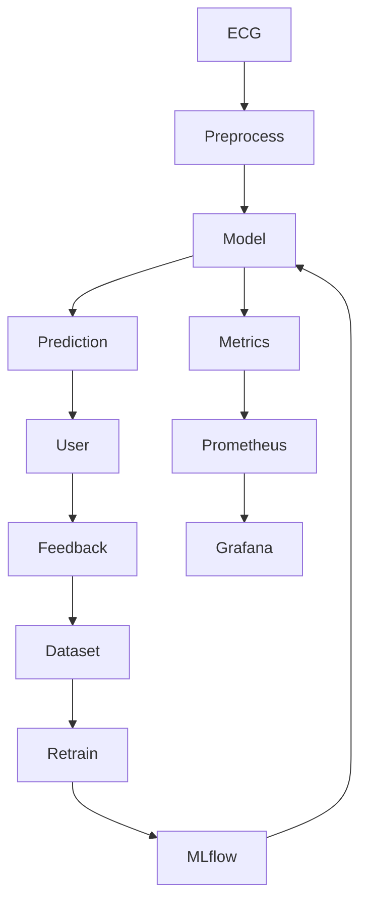

# ДЗ Лекция 7 — Monitoring, Drift и Retraining

**Проект:** BeatSense — веб-приложение для анализа ЭКГ и классификации сердечных аномалий  
**Стек:** React + FastAPI + PyTorch (CNN/LSTM), Docker, (план: Prometheus, Grafana, MLflow, Evidently)

---

## 1. Сервисный мониторинг

У нас один основной канал инференса — backend API.

| Метрика | Как измеряется | Где смотреть | Цель |
|--------|----------------|-------------|------|
| Availability | uptime API + healthcheck | Docker / Prometheus | ≥ 99% |
| P95 Latency | время ответа `/predict` | Prometheus | < 300 мс |
| Error Rate | HTTP 5xx + exceptions | логи + Prometheus | < 1% |
| Throughput | запросы/день | логи | информативно |

---

## 2. Мониторинг входных данных

ECG — временной ряд, поэтому контроль специфичный:

- Проверка NaN / пустых сигналов  
- Минимальная длина сигнала  
- Проверка формата (массив чисел)  
- Контроль структуры (фиксированная длина / ресемплинг)  

**Статистики:**
- mean амплитуды  
- std  
- частота пиков  

**Drift-сигналы:**
- изменение амплитуды (другие устройства)  
- изменение формы сигнала  
- изменение частоты сердечных сокращений  

План: Evidently + KS-test

---

## 3. Мониторинг предсказаний модели

- Confidence = max softmax probability  
- Low-confidence: < 0.6  
- Fallback: "не уверен"  

**Отслеживаем:**
- долю low-confidence  
- долю fallback  
- распределение классов  
- средний confidence  

**Аномалии:**
- перекос в один класс  
- падение confidence  
- резкое изменение распределений  

---

## 4. Monitoring бизнес-поведения

BeatSense — decision support tool:

- Исправления пользователем  
- Подтверждения  
- Спорные кейсы  
- Отказы от результата  

**KPI:**
- ускорение анализа ЭКГ  
- снижение ошибок врача  

---

## 5. Observability стек

| Задача | Инструмент | Роль |
|--------|------------|------|
| Метрики | Prometheus | сбор |
| Дашборды | Grafana | визуализация |
| Drift | Evidently | анализ |
| Registry | MLflow | версии моделей |
| CI/CD | GitHub Actions | автоматизация |

---

## 6. Дашборды

1. Service:
   - latency
   - error rate
   - uptime  

2. Data:
   - распределения сигналов  
   - длина ECG  

3. Model:
   - классы  
   - confidence  
   - fallback  

4. Drift:
   - KS-test  
   - статистики  

---

## 7. Алерты

| Сигнал | Порог | Действие |
|--------|------|----------|
| Latency | > 500 мс | оптимизация |
| Error rate | > 2% | проверка логов |
| Drift | p < 0.05 | аудит данных |
| Low-confidence | +10% | анализ модели |
| Fallback | > 20% | retraining |
| Pipeline fail | ошибка CI | фикс |

---

## 8. Human feedback loop

- Пользователь подтверждает результат  
- Может исправить класс  
- Данные сохраняются  
- Формируются hard cases  

---

## 9. Versioning / Registry

| Вопрос | Ответ |
|--------|------|
| Основная модель | model_v1 |
| Кандидат | model_v2 |
| Данные | MIT-BIH |
| Метрики | MLflow |
| Отличия | recall / F1 |

---

## 10. Retraining policy

**Когда audit:**
- каждые 2 недели  
- при алертах  

**Когда retraining:**
- накоплено 100+ исправлений  
- drift + падение качества  

**Когда НЕ нужен:**
- баг системы  
- нет деградации  

**Кто решает:**
- ML Engineer  

**Сравнение:**
- единый validation set  

**Rollout:**
- CI/CD деплой  
- возможность rollback  

---

## 11. Архитектура

---

## Самопроверка

- Service vs Model monitoring — понимаю разницу:
  - Service = работает ли система  
  - Model = адекватны ли предсказания  

- Инструменты — понимаю:
  - Prometheus → метрики  
  - Grafana → визуализация  
  - Evidently → drift  
  - MLflow → версии  

- Drift — понимаю:
  - изменение распределений  
  - смена источника данных  
  - изменение статистик сигнала  

- Retraining — понимаю:
  - нужен при падении качества или накоплении данных  
  - не нужен при багах  

- Прод — могу объяснить:
  - модель v1  
  - API FastAPI  
  - мониторинг через Prometheus (план)  

---

## Итог

BeatSense находится на уровне MVP.  
Основные ML-компоненты реализованы, но отсутствует полноценный monitoring и MLOps-контур.  
Перед production необходимо внедрить:
- monitoring метрик  
- алерты  
- feedback loop  
- retraining pipeline  
