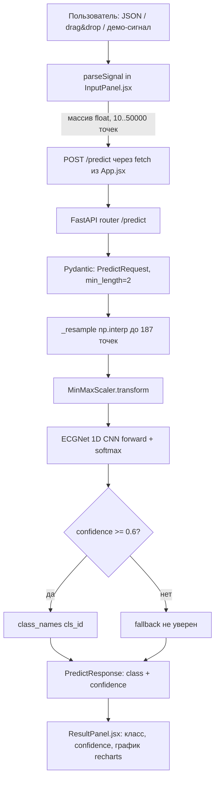
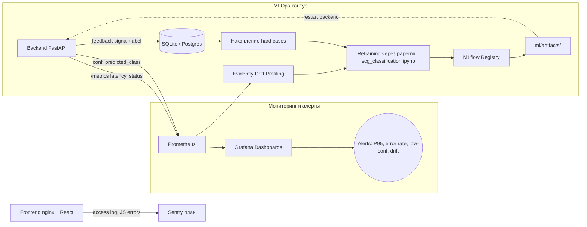

# Архитектура развертывания и инференса BeatSense (ECG Classification)

## 1. Описание AI-системы и её контекста
**BeatSense** — учебный MVP веб-приложения для автоматической классификации ЭКГ-сигналов с помощью 1D CNN, обученной на датасете MIT-BIH (ECG Heartbeat Categorization Dataset).
Система решает одну задачу:
*   **Мультиклассовая классификация сокращения:** Normal, Supraventricular ectopic, Ventricular ectopic, Fusion, Unknown (5 классов).

**Контекст:** Приложение позиционируется как инструмент **предварительной оценки** для исследователей, студентов и врачей при работе с уже оцифрованными сигналами ЭКГ. **Не является медицинским устройством** и не используется для постановки диагноза. Доступ — через браузер, развёртывание — Docker Compose на одном хосте (учебный сценарий).

## 2. Выбор режима инференса
Для данной системы выбран **синхронный серверный инференс через REST API (Server-Side / Cloud Inference)**.

**Обоснование:**
*   **Один источник модели:** артефакты (`ecg_model.pt`, `scaler.pkl`, `meta.pkl`) лежат в `ml/artifacts/` и монтируются в backend-контейнер read-only — нет нужды распространять модель на клиентов и поддерживать совместимость версий браузера.
*   **Простота обновления:** новая модель — это перезапуск одного контейнера (`docker-compose restart backend`), `lifespan` в `src/backend/main.py:14` перечитает артефакты при старте.
*   **Тонкий клиент:** фронтенд (React 18 + Vite) не тянет PyTorch/ONNX runtime в браузер; bundle остаётся компактным, инференс не упирается в WebAssembly или WebGL.
*   **Low latency:** сигнал короткий (≤ 50 000 точек на входе, ресемпл до 187), CNN всего 44 229 параметров — CPU-инференс укладывается в SLO без аппаратного ускорения.
*   **Учебный сценарий:** персональные данные пациентов не обрабатываются (PRD §4 явно их исключает), поэтому жёстких требований к on-device-инференсу нет.

## 3. Схема inference pipeline
Процесс обработки данных от ввода сигнала на фронте до отображения результата:



## 4. Выбор инструментов и обоснование
| Слой | Инструмент | Обоснование |
| :--- | :--- | :--- |
| **Frontend Framework** | React 18 + Vite | SPA с быстрым dev-сервером (HMR), проксированием `/ping` и `/predict` на backend, прод-сборка отдаётся через nginx. |
| **Визуализация сигнала** | recharts | Декларативный API поверх React, минимум кода для отрисовки одной линии сигнала и подсветки результата. |
| **Backend Framework** | FastAPI + Uvicorn | Async-роутинг, автогенерация OpenAPI-схемы из Pydantic-моделей, дешёвый CORS, lifespan для загрузки модели один раз при старте. |
| **Inference Engine** | PyTorch (CPU) | Совпадает со стеком обучения в `notebooks/ecg_classification.ipynb` — без конверсии в ONNX/TFLite, минимум расхождений train/serve. CPU достаточно при 44 229 параметрах. |
| **Препроцессинг** | NumPy + scikit-learn (`MinMaxScaler`) | `np.interp` для ресемплинга до 187 точек, `MinMaxScaler` сериализован в `scaler.pkl` — те же преобразования, что и в обучающем пайплайне. |
| **Контейнеризация** | Docker Compose (backend + frontend) | Один файл `src/docker/docker-compose.yml` поднимает оба сервиса; артефакты модели монтируются как read-only volume. |
| **Reverse-proxy** | nginx (в `frontend.Dockerfile`) | Раздаёт собранный Vite-bundle и проксирует `/ping`, `/predict` на backend:8000 — фронтенд не зависит от CORS в проде. |
| **Validation** | Pydantic v2 | Гарантирует тип сигнала (`list[float]`, `min_length=2`) до того, как запрос дойдёт до модели; неверные тела возвращают 422. |

## 5. Описание API-контракта моделей
Инференс осуществляется через REST API; контракт описан в `src/backend/schemas.py` и продублирован в OpenAPI `/docs`.

### А. Healthcheck
*   **Endpoint:** `GET /ping`
*   **Output:** `{ "status": "ok" }` (HTTP 200), тип `PingResponse`. Используется для docker healthcheck и мониторинга uptime.

### Б. Предсказание класса сокращения
*   **Endpoint:** `POST /predict`
*   **Input (`PredictRequest`):**
    ```json
    { "signal": [0.12, 0.18, 0.27, ...] }
    ```
    Массив `float`, длина ≥ 2 (Pydantic), на фронте — от 10 до 50 000 точек. Любая длина линейно ресемплится до 187 точек через `np.interp` (`src/backend/model.py:55`).
*   **Output (`PredictResponse`):**
    ```json
    { "class": "Normal", "confidence": 0.92 }
    ```
    *   `class` — один из `["Normal", "Supraventricular", "Ventricular", "Fusion", "Unknown"]` либо строка `"не уверен"` при `confidence < 0.6` (порог `low_conf_threshold` из `meta.pkl`).
    *   `confidence` — максимальная softmax-вероятность, округлённая до 4 знаков.
*   **Ошибки:** `422 Unprocessable Entity` — невалидное тело (нечисловой элемент, длина < 2). `500 Internal Server Error` — сбой `run_inference()` или незагруженные артефакты.

## 6. Список SLI/SLO
Для серверного инференса BeatSense установлены следующие целевые показатели (согласуются с PRD и `tasks/beatsense_monitoring_hw7.md`):

*   **Latency SLO:**
    *   `POST /predict` без учёта сети: P95 < 1 секунды на CPU контейнера backend.
    *   E2E (клик «Анализировать» → отрисовка результата): ≤ 5 секунд.
*   **Availability SLO:** 99% за календарный месяц (учебный MVP). Контролируется `GET /ping` и uptime процесса uvicorn.
*   **Error Rate SLO:** доля `5xx` на `/predict` < 2%; 422 не считаются ошибкой сервиса (валидация работает корректно).
*   **Throughput SLI:** число успешных `POST /predict` в день (информативная метрика — нагрузка учебная).
*   **Model Accuracy SLO:** F1 macro ≥ 0.85 на актуальном test-срезе MIT-BIH (DoD §2 — порог retraining 0.80, целевое значение модели — 0.88).
*   **Low-confidence SLO:** доля ответов `class == "не уверен"` ≤ 20% от общего числа запросов за сутки.

## 7. Стратегия rollout и план rollback
Развертывание новых версий моделей и сервиса в учебном сценарии идёт через Docker Compose и Git, без CDN и Remote Config.

1.  **Phase 1: Staging-чекпоинт.** Новая модель регистрируется в MLflow как `Staging`, артефакты публикуются в отдельную ветку/тег. Прогон `test`-сета из `data/test/` через `run_inference()` обоих чекпоинтов: новый принимается только если F1 macro ≥ старого ± допуск и нет деградации по редким классам (1, 3).
2.  **Phase 2: Canary на одном инстансе.** Артефакты подкладываются в `ml/artifacts/` локального хоста, `docker-compose restart backend` — `lifespan` перечитает модель. Параллельно крутится Grafana-дашборд: P95 latency, error rate, средний confidence, распределение классов.
3.  **Phase 3: Promotion.** При отсутствии деградации за окно наблюдения (24–48 ч) тэг артефактов и образ backend помечаются как `Production` в MLflow, фиксируются в git (`git tag model-vN`).

**План Rollback:**
*   Артефакты модели версионируются git-тегами (`model-v{N}`). Откат — `git checkout model-v{N-1} -- ml/artifacts/` и `docker-compose restart backend` (`lifespan` загрузит старые `ecg_model.pt` / `scaler.pkl` / `meta.pkl`).
*   Если ломается код backend — `docker-compose down && docker-compose up --build` со старого SHA. Frontend независим (nginx + статика) и откатывается отдельно.
*   Если ломается контракт `PredictResponse` — фронт продолжает работать, потому что recharts падает только на парсинге результата; пользователь получит ошибку «не удалось получить результат» из `App.jsx` `catch`, и сервис будет откачен в течение минут.

## 8. Схема observability и план сбора данных
Для отслеживания качества работы системы в реальных условиях запланирована следующая схема мониторинга (детали — в `tasks/beatsense_monitoring_hw7.md`):



**План сбора данных:**
*   **Service metrics:** `prometheus-fastapi-instrumentator` отдаёт latency-гистограммы, RPS и счётчики ошибок на `/metrics`; nginx access log собирает frontend availability.
*   **Model metrics:** в `run_inference()` (`src/backend/model.py:63`) логируются `predicted_class`, `confidence`, флаг fallback, длина исходного сигнала и факт ресемплинга (если длина ≠ 187 — кандидат на drift).
*   **Data profiling:** Evidently запускается офлайн по накопленным сигналам — K-S тест по точкам сигнала, PSI по распределению предсказаний, сравнение с baseline `data/test/`.
*   **Feedback Loop:** в `ResultPanel.jsx` планируется кнопка «Подтвердить / Исправить класс». Пара `(signal, predicted_class, true_class, confidence)` пишется в БД рядом с backend; кейсы с `confidence < 0.6` И исправленным классом — приоритет для следующего retraining-батча. Персональные данные не сохраняются (PRD §4 их исключает).
*   **Retraining trigger:** запускается при накоплении 100+ исправлений (CLAUDE.md), F1 macro < 0.80 на свежем срезе (DoD §2) или подтверждённом drift + падении Accuracy. Прогон `notebooks/ecg_classification.ipynb` через `papermill` в GitHub Actions, артефакты — в MLflow.
